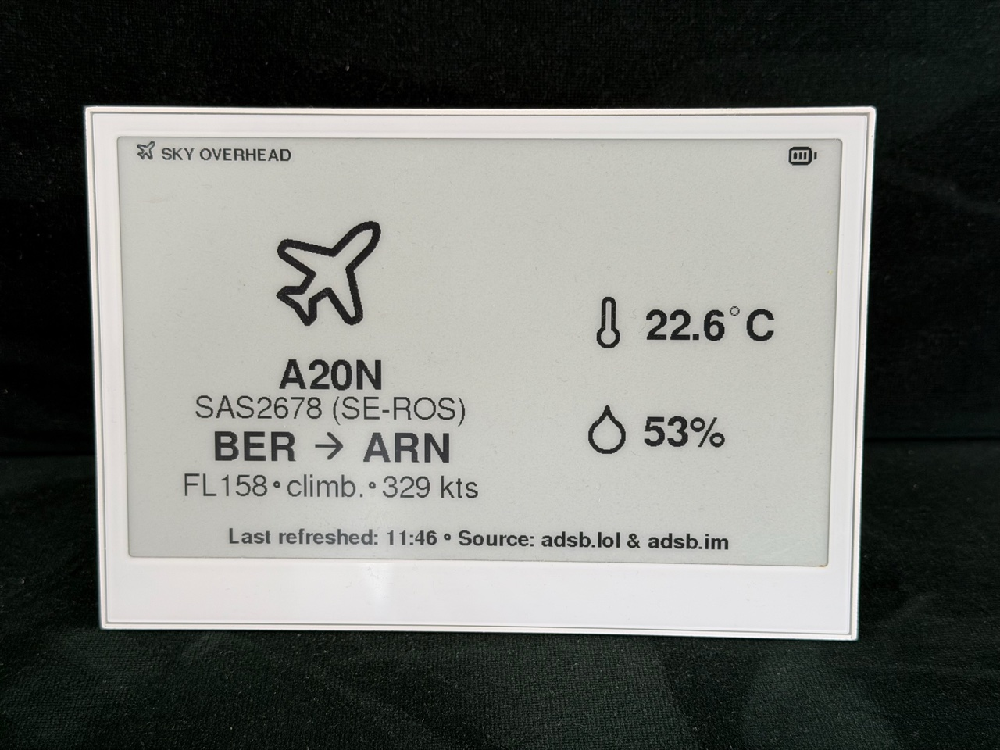

# Sky Overhead

[](https://github.com/kovaacs/sky_overhead/actions/workflows/ci.yml)
[](https://github.com/kovaacs/sky_overhead/releases/latest)
[](LICENSE)

<p align="center">
  
</p>

Sky Overhead is an Arduino sketch for the Seeed reTerminal E1001 / XIAO ESP32S3. It shows the nearest overhead aircraft on the e-paper display, with type, callsign, tail number, airline, route, altitude, trend, and speed. A side panel shows the onboard temperature and humidity sensor.

It is built to behave like a quiet wall appliance: wake, fetch, redraw when aircraft or display state changes or the configured maximum refresh interval is due, then sleep. Temporary network failures leave the last good screen in place, and quiet hours pause aircraft checks overnight.

## Hardware

- Seeed reTerminal E1001 with XIAO ESP32S3
- Built-in 800 x 480 e-paper display, UC8179 driver, via Seeed_GFX / TFT_eSPI
- Built-in SHT4x temperature/humidity sensor on I2C, GPIO19 SDA / GPIO20 SCL
- microSD card for `/config.txt`, using HSPI: CS GPIO14, SCK GPIO7, MOSI GPIO9, MISO GPIO8
- SD card power-enable on GPIO16
- Battery voltage sense on GPIO1 after pulling GPIO21 high
- Serial debug on `Serial1`, GPIO43 TX / GPIO44 RX, 115200 baud; this is not USB CDC
- Wi-Fi network with internet access

## Data Sources

The sketch uses keyless ADS-B sources:

- `adsb.lol` as the primary live-aircraft source
- optional local readsb/tar1090 `aircraft.json` via `LOCAL_ADSB_URL` when `adsb.lol` errors
- `adsb.im` for route lookup by callsign plus live aircraft position

## Runtime Lifecycle

Each update is a full reboot from deep sleep. On wake, the sketch reads config, connects Wi-Fi, syncs time, skips aircraft checks during quiet hours, fetches aircraft and route data, redraws when the render signature changes or `MAX_REFRESH` is due, then sleeps again.

```text
Wake from deep sleep
  |
  v
Read /config.txt, initialize display and sensor
  |
  v
Connect Wi-Fi and sync time
  |
  +-- quiet hours -> draw sleep screen -> sleep until morning
  |
  v
Fetch aircraft
  |
  +-- try adsb.lol
  |      |
  |      +-- found aircraft -> use adsb.lol
  |      +-- empty          -> show empty sky
  |      +-- error          -> try local feed if configured
  |
  +-- local feed after adsb.lol error
  |      |
  |      +-- found aircraft -> use local feed
  |      +-- empty          -> show empty sky
  |      +-- error          -> keep screen, sleep briefly, retry from adsb.lol
  |
  +-- no local feed after adsb.lol error -> keep screen, sleep briefly, retry from adsb.lol
  |
  v
Fetch route from adsb.im when an aircraft was found
  |
  v
Read battery and climate sensor
  |
  v
Build render signature
  |
  +-- unchanged and MAX_REFRESH not due -> skip e-paper refresh
  |
  v
Draw, update e-paper, save state, sleep BUSY seconds
```

State that must survive deep sleep lives in `RTC_DATA_ATTR`: last rendered signature, last-seen aircraft, retained route, timestamp, and redraw count.

## Display

- Left column: active aircraft, or retained last-seen aircraft when nothing current is found.
- Right column: indoor temperature and humidity.
- Quiet hours: moon-icon sleep screen while aircraft checks are paused.
- Footer: local refresh time, a dot glyph, and the sources for the displayed snapshot, for example `Last refreshed: 14:32 · Source: adsb.lol & adsb.im`.
- Primary aircraft label: aircraft description such as `AIRBUS A-320neo` when it fits, otherwise the type code; rotorcraft use a helicopter glyph when ADS-B reports category `A7`.
- Secondary labels: callsign and tail number, for example `FIN7EH (OH-LZH)`, then airline.
- Detail row: altitude, vertical trend, and speed, for example `FL132 | climb. | 307 kts`.
- Missing aircraft fields collapse upward instead of leaving blank rows.
- A different aircraft or changed static display state redraws immediately. Same-aircraft telemetry and climate changes alone do not redraw the display. Every 20 redraws, a full white refresh reduces accumulated ghosting.

The screen is intentionally not live second-by-second. Each wake reads fresh data and immediately redraws when the selected aircraft or static display state changes. Altitude, trend, speed, temperature, and humidity update opportunistically with those redraws. A positive `MAX_REFRESH` forces a redraw on the first wake after the interval elapses; it does not shorten `BUSY` sleeps or interrupt `NIGHT_MODE`.

Reusable display glyphs are generated from Lucide SVGs. Firmware builds automatically download the required icons from an immutable Lucide commit and regenerate `IconFont.h` when the generator changes. Neither the source SVGs nor generated header are stored in the repository.

## Hardware Quirks

- Keep `SPIClass spiSD(HSPI)` local inside SD-card functions. A file-scope `SPIClass` can crash on boot because the constructor runs before FreeRTOS is ready.
- Avoid partial e-paper refresh. `updataPartial()` exists in the UC8179 driver, but it produces heavy ghosting with the built-in waveform LUT. Use full `update()` only.
- Use `460800` upload speed. `921600` can drop this USB-serial adapter during the baud switch.
- The SD card slot is explicitly powered only while reading config, then powered down before Wi-Fi and fetch work.

## Arduino Setup

Install Arduino CLI 1.3.0 or newer, then install the pinned development dependencies:

```bash
tools/setup_arduino_dependencies.sh
```

The first firmware build also needs `rsvg-convert` and ImageMagick to generate the icon font:

```bash
# macOS
brew install librsvg imagemagick

# Debian/Ubuntu
sudo apt-get install librsvg2-bin imagemagick
```

The setup script installs ArduinoJson for the standalone C++ test runner and fetches the pinned Seeed display library. The committed `sketch.yaml` separately pins the ESP32 board package, ArduinoJson, Sensirion libraries, board options, and Seeed_GFX revision for isolated firmware builds. Seeed_GFX is fetched separately because it is not published in the Arduino Library Index; it provides the reTerminal E Series e-paper `TFT_eSPI.h` / `EPaper` stack and is not the stock Bodmer TFT_eSPI library.

The included `driver.h` selects Seeed's E1001 display setup with `BOARD_SCREEN_COMBO 520`. If compilation fails with missing `TFT_eSPI.h`, `EPaper`, or `EPAPER_ENABLE`, check Seeed_GFX and `driver.h`.

Seeed's reTerminal E Series Arduino cookbooks are useful references for the display and onboard peripherals:

- https://wiki.seeedstudio.com/reterminal_e10xx_with_arduino/
- https://wiki.seeedstudio.com/reterminal_e10xx_with_arduino_peripherals/

## Board Options

Use the XIAO ESP32S3 target with these options:

```text
esp32:esp32:XIAO_ESP32S3:PSRAM=opi,UploadSpeed=460800,FlashSize=8M,PartitionScheme=default_8MB
```

The `460800` upload speed is intentional. On this USB-serial adapter, `921600` can drop the connection during upload.

## SD Card Config

Runtime settings are read from a plain text file at the root of the microSD card:

```text
/config.txt
```

Use a FAT-formatted card and copy [`config.example.txt`](config.example.txt) to `config.txt` in the card's root directory, then replace the placeholder values. Use one `KEY=VALUE` pair per line. Spaces around `=` are accepted; quoted values are not needed. Setting names are case-insensitive, as are documented option values such as `kts`, `metric`, `f`, `true`, and `on`. Blank lines and `#` comments are ignored.

Required fields:

- `SSID`: Wi-Fi network name
- `LAT`, `LON`: observer location in decimal degrees
- `ALT`: observer altitude in meters
- `TZ`: POSIX timezone string used for local timestamps and quiet hours

Optional behavior fields:

- `PASS`: Wi-Fi password; leave empty for an open network
- `SPEED`: `kph`, `mph`, or `kts`
- `HEIGHT`: `ftfl` or `metric`
- `TEMP`: `c` or `f`
- `RADIUS`: aircraft search radius in kilometers, constrained to 1–463 km by the public source's 250 NM limit
- `NIGHT_MODE`: quiet-hours range in `HH:MM-HH:MM`; omit it or leave it empty to disable night mode
- `BUSY`: normal sleep interval in seconds, constrained to 15–600
- `MAX_REFRESH`: interval in seconds after which the next wake forces a display update; defaults to `0`, which disables forced redraws, while positive values are constrained to 60–86400 and do not shorten sleep intervals
- `DEMO`: `1` to skip network fetches and cycle through dummy live, retained-aircraft, and night screens for layout iteration; `0` for normal operation
- `LOCAL_ADSB_URL`: optional readsb/tar1090 fallback base URL, for example `http://192.168.1.20:8080`; the firmware appends `/data/aircraft.json`

Units, radius, and sleep interval have defaults. Quiet hours are disabled unless `NIGHT_MODE` is configured. The firmware tries `adsb.lol` first; if that request fails and `LOCAL_ADSB_URL` is configured, it falls back to the local feed. Prefer a DHCP-reserved LAN IP over an `.local` hostname.

The footer shows source labels such as `adsb.lol`, `local feed`, or `local feed & retained route`.

Example timezone values:

- Budapest/Berlin/Central Europe: `CET-1CEST,M3.5.0,M10.5.0/3`
- UTC: `UTC0`

Observer location:

- Use meters above sea level for `ALT`.
- `LAT`, `LON`, and `ALT` should describe the location used for nearest-aircraft selection, usually the display or feeder antenna location.

## Data and Privacy

Wi-Fi credentials and runtime settings stay on the microSD card; `config.txt` is ignored by Git to reduce the risk of publishing it accidentally. The firmware does not send the Wi-Fi password to any data provider.

The configured observer latitude and longitude are included in requests to `adsb.lol`. The optional local ADS-B feed is only queried when the public aircraft request fails, so configuring it does not keep aircraft discovery on the local network. Aircraft position and callsign are sent to `adsb.im` for route lookup.

HTTPS certificate verification is disabled in the current firmware to accommodate the embedded networking stack. Do not treat returned aircraft or route data as authenticated or safety-critical information.

## Tests

Run the host-side unit suite before compiling or flashing:

```bash
tools/run_unit_tests.sh
```

The tests cover pure logic that can run without the board: aircraft and climate formatting, display-view layout, cascade behavior, config parsing, quiet-hours timing, retained state, and JSON parsers. The runner auto-detects ArduinoJson in the usual Arduino library folders. If ArduinoJson is elsewhere:

```bash
ARDUINO_JSON_INC=/path/to/ArduinoJson/src tools/run_unit_tests.sh
```

## Compile

After running the dependency setup, compile from this directory. The build wrapper prepares the icon font and then invokes Arduino CLI using the default profile in `sketch.yaml`:

```bash
tools/build_firmware.sh
```

## Flash

To install a published release without compiling, download the merged binary and checksums from [GitHub Releases](https://github.com/kovaacs/sky_overhead/releases/latest). Follow [FLASHING.md](FLASHING.md) to verify the download, flash it with esptool, recover with BOOT/RESET if needed, and prepare the microSD card.

To compile and upload from source, connect the device over USB and find the serial port:

```bash
arduino-cli board list
```

Use the USB Serial Port, typically `/dev/cu.usbserial-*`; skip Bluetooth ports. If no USB serial port appears, press RESET. If upload still cannot connect, hold BOOT, tap RESET, release BOOT, then retry to force ROM bootloader mode.

Upload with the detected port, replacing `<PORT>` with the value shown by `arduino-cli board list`:

```bash
arduino-cli upload \
  --fqbn "esp32:esp32:XIAO_ESP32S3:PSRAM=opi,UploadSpeed=460800,FlashSize=8M,PartitionScheme=default_8MB" \
  --port <PORT> \
  .
```

To compile and upload in one command:

```bash
tools/build_firmware.sh --upload \
  --fqbn "esp32:esp32:XIAO_ESP32S3:PSRAM=opi,UploadSpeed=460800,FlashSize=8M,PartitionScheme=default_8MB" \
  --port <PORT>
```

Serial debug output from the sketch is on the hardware UART at 115200 baud, GPIO43 TX / GPIO44 RX. That is separate from the USB upload port and upload speed.

## Contributing

See [CONTRIBUTING.md](CONTRIBUTING.md) for development setup, testing expectations, and pull request guidance.
